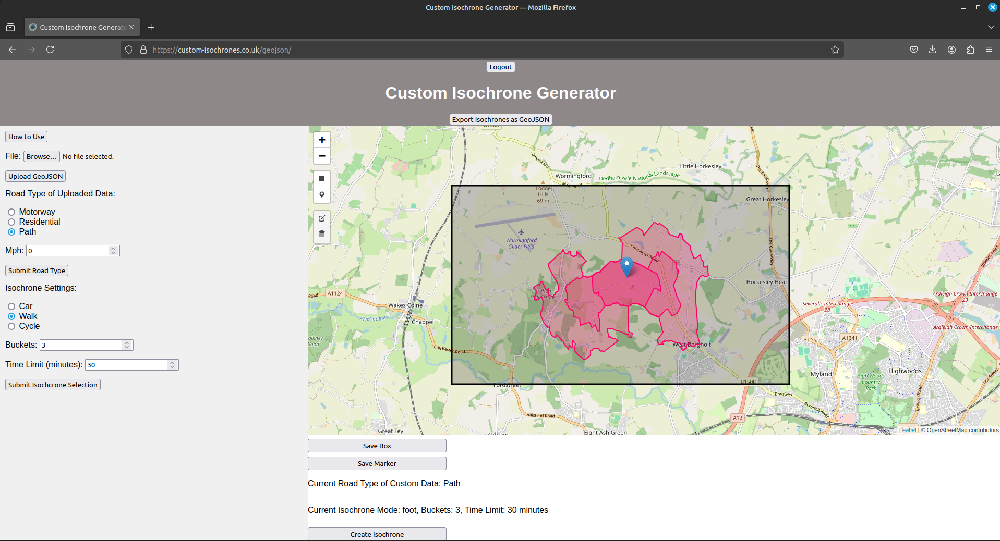

# Travel Time Isochrone Web Application

This is a web application designed to create travel time isochrone geometries based on existing (OpenStreetMap) and custom-inputted travel networks.

### Demonstration

#### Isochrone without custom data:

#### Isochrone with custom data added:

#### What is a isochrone?

Isochrones, also called travel time polygons or travel time maps, show all locations that can be reached within a specified time limit using a particular mode of transport. TravelTime has some good [examples](https://docs.traveltime.com/api/use-cases/isochrones)

## How to Use the Webapp

This webapp is a tool to generate travel-time isochrones with 'Custom Data' that is not available on Open Street Map.

The 'Custom Data' geometry must be linestrings or multilinestrings, in geojson format.

To produce this geometry so it is compatible with the site, you need to use existing osm data as a reference point. For example, if you want a road to continue on from another existing road, its geometry needs to intersect with the existing osm road geometry.

## Step by Step:

1. **Download OSM data for your area of interest.**
    - This can be done via a number of methods/services:
        - [QGIS with QuickOSM](https://plugins.qgis.org/plugins/QuickOSM/)
        - [Overpass Turbo](https://overpass-turbo.eu/)
        - [OSMnx](https://osmnx.readthedocs.io/en/stable/)
2. **Ensure your network geometry intersects with existing osm data you have downloaded.**
    Make sure to draw/adjust lines so that they are intersecting the osm data you have downloaded if you want your geometries to simulate a new addition to an existing transport network. Examples are:
    - [QGIS](https://qgis.org/en/site/)
    - [Mapshaper](https://mapshaper.org/)
    - [GeoJSON.io](https://geojson.io)

    All these tools allow you to export drawn data in geojson format. To guarantee your custom geometries will be compatible, make sure they are in WGS84 (4326) coordinate system. It does not matter what attributes these geometries have.

3. **Upload your custom drawn data to the site (not the existing osm data), define and submit the max speed and type of road.**
4. **Define the travel type for the routing algorithm, the time limit, and buckets (number by which to divide the given time limit to create buckets nested isochrones of time intervals).**
5. **Draw a bounding box around your custom data on the map, which will define the bounds of the isochrone. The larger this box, the longer the analysis will take.**
6. **Place a marker inside this box which will define the starting point of the isochrone.**
7. **After doing all this, press the 'Create Isochrone' button, and wait for the analysis. This can take a while if the road type, custom data, or bounding box has changed. If only the isochrone settings or marker has changed after creating an isochrone, it will be a lot faster.**
8. **When the isochrone is displayed on the map, you can download it as a geojson file. You may have to refresh the page to make sure the file is the latest isochrone generated.**

### Routing

[Graphhopper](https://github.com/graphhopper/graphhopper) 8.0 is used for the routing backend. It's a fast and memory-efficient routing engine well-suited for browser-based analysis. In this application, Graphhopper is containerized in the Docker image [graphhopper.tar.gz](graphhopper.tar.gz), and its configuration is located in [media/user_osm_files/master.yaml](media/user_osm_files/master.yaml). Currently, this app supports three modes of transport: driving (car), walking, and cycling.

### User Authentication

You need to log in to this web application. Anyone can register by providing a unique username and password, but you will need an access code to access the site. The access code is defined in the `CustomAuthForm` class in [myapp/forms.py](myapp/forms.py). You can change this code if you want to deploy the app yourself.

### limitations:

- There is a input geojson file size limit of 5 megabytes.
- There is a size limit on the bounding box of 50000 Hectares. This is to limit processing time and also limit Overpass API quries

## How the App Works

- The user uploads a bounding box and a geometry to integrate with the existing infrastructure.
- The bounds of the bounding box are used to query OSMnx, a Python package, to download existing transport networks from OpenStreetMap data using Overpass API.
- The user-uploaded geometry is then integrated into the existing OSM data with the specified network type, complying with the .osm XML format.
- A Graphhopper pod is deployed in the Amazon Elastic Kubernetes Service (EKS) cluster, accessing the user's .osm file through the Amazon Elastic File System (EFS).
- The Django application queries the pod with the user-specified isochrone settings and displays the isochrone, which can be downloaded as a GeoJSON file.

## How to Deploy and Run the App Using AWS and Terraform

To deploy and run the app on AWS, follow these steps:

1. Navigate to the [terraform_configs](terraform_configs) directory.
2. Apply the Terraform configurations in each folder sequentially, following the numerical order.

#### Manual Inputs Required:

- **08-load-balancer**: Define the SSL certificate ARN in the `certificate_arn` variable to enable HTTPS.
- **09-route53**: Provide values for the `certificate_validation_name` and `certificate_validation_record` variables, and a different domain name for the hosted zone.

#### Additional Information:

- The application load balancer requires some time to deploy after the ingress resource is created. During this time, you will need to wait until the `alb_dns_name` becomes available. You can retrieve this name from the AWS CLI or the management console, as it is not outputted in the remote state.

## Acknowledgements

This application utilizes the following software and technologies: Django (GeoDjango), OpenStreetMap, GraphHopper, Leaflet, OSMnx, PostgreSQL (PostGIS), GeoPandas, Shapely, Docker, Kubernetes, Terraform and AWS.

## License

This project uses data from [OpenStreetMap](https://www.openstreetmap.org/), which is made available under the [Open Database License (ODbL)](https://opendatacommons.org/licenses/odbl/1-0/).

This project is licensed under the MIT License - see the [LICENSE](LICENSE) file for details.